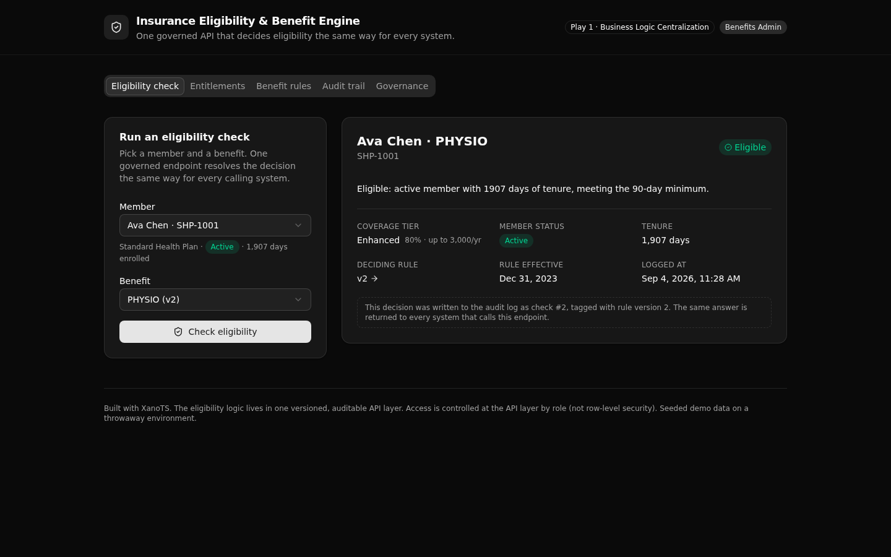

# Insurance Eligibility & Benefit Engine

One governed API that decides insurance eligibility the same way for every system, and returns the exact plan rule version that made the call.

This is a XanoTS proof for **Play 1, Business Logic Centralization**, in insurance. The plan eligibility logic that usually lives copied across every claims tool and member portal is pulled into one versioned, auditable API layer that many systems trust. A reviewer can read the rule, run a check, and see the same governed decision plus the rule version behind it.

**6 tables · 10 API endpoints · 2 RBAC roles**, authored in TypeScript with `@xanots/sdk`, type-checked, and deployed live to an ephemeral Xano environment.



## What it demonstrates

An insurer runs the same eligibility question in many places: a claims tool, a member portal, a support console. When each one encodes its own copy of the plan rules, the answers drift and no one can explain a past decision. This backend makes that logic one thing.

- **One decision, one place.** A single `check` endpoint resolves the active rule for a member's plan and benefit, evaluates the status and tenure gates, and returns the decision, the coverage tier, and the rule version. Every calling system gets the same answer.
- **Versioned rules.** Each benefit on each plan has one active rule and a history of superseded versions. A decision records the version that made it, so it can be explained later.
- **An audit trail.** Every check writes a row: the decision, the reason, the rule version, and the tier. The log is filterable by member, benefit, or decision.
- **API-layer RBAC.** Two roles, `benefits_admin` and `read_only`, enforced at the endpoint. This is middleware-style access control, not row-level security. The role is read fresh from the staff table on every call.

## Screens

The React frontend calls the endpoints and shows the governed result.

- **Eligibility check.** Pick a member and a benefit, run the check, see eligible or not with the coverage tier, the reason, and a link to the deciding rule version.
- **Member entitlements.** Every benefit a member is covered for right now, run through the same gates.
- **Benefit rules.** The active rule for each plan and benefit, with its full version history so a reviewer can see a superseded version.
- **Audit trail.** The decision log, newest first, joined to the rule version and tier each check used. Admin only.
- **Governance.** Sign in as either role and run an access probe that shows the API return 401, 403, and 200 for the same admin endpoint.

## API surface

Base path per group is `/api:<canonical>`. Public endpoints need no token. Admin endpoints require a `benefits_admin` bearer token.

| Verb | Path | What it does | Access |
| --- | --- | --- | --- |
| POST | `/api:ie_eligibility/check` | Resolve the active rule, evaluate the gates, return the decision and rule version, write an audit row | Public |
| GET | `/api:ie_eligibility/entitlements/{member_number}` | Every benefit the member currently passes, with tiers | Public |
| GET | `/api:ie_eligibility/members` | Member directory with plan and tenure, for the pickers | Public |
| GET | `/api:ie_eligibility/catalog` | The active benefit rules with plan and tier | Public |
| GET | `/api:ie_rules/detail/{benefit_rule_id}` | One rule plus the full version history for its plan and benefit | Public |
| GET | `/api:ie_rules/list` | Every rule version across every plan | benefits_admin |
| GET | `/api:ie_audit/checks` | The decision log, filterable, joined to the rule version and tier | benefits_admin |
| POST | `/api:ie_seed/reset` | Clear the decision log and reload the reference data | benefits_admin |
| POST | `/api:ie_auth/login` | Verify a credential and mint a role-scoped token | Public |
| GET | `/api:ie_auth/me` | The signed-in caller's record | Authenticated |

## Repo layout

```
xano/
  index.ts               the workspace, registering every table, group, and endpoint
  seed-data.ts           the demo rows (plans, tiers, members, versioned rules, staff)
  tables/                plans, coverage_tiers, members, benefit_rules, eligibility_checks, staff
  api/
    groups.ts            the five API groups with pinned canonical slugs
    check.ts             the core governed decision
    entitlements.ts      a member's active entitlements
    members.ts           the member directory
    catalog.ts           the active benefit rules
    rules-detail.ts      one rule plus its version history
    rules-list.ts        the full rule history (admin)
    audit-checks.ts      the decision log (admin)
    seed-reset.ts        reset the demo data (admin)
    auth-login.ts        sign in
    auth-me.ts           the signed-in caller
    _guards.ts           the shared admin role guard
  xano.lock              pins object identities and URLs (committed)
frontend/                React, Vite, Tailwind, shadcn/ui
  src/lib/api.ts         the one contract: paths and types derived from the query defs
```

## Quick start

You need Node 20.19 or newer and a Xano account.

```bash
git clone https://github.com/xano-scratch/insurance-eligibility-benefit-engine
cd insurance-eligibility-benefit-engine
npm install
npx xanots login          # authenticate once with your Xano account
npm run xano:deploy       # type-check, build the frontend, deploy, print the live URL
```

`npm run xano:deploy` ships the backend and the static frontend to a fresh, auto-expiring ephemeral environment and self-seeds it, so it is browsable the moment the URL prints. Redeploy any time for fresh links.

The deploy passes `--allow-seed-in-static` because the two demo staff credentials are seeded on purpose for the throwaway environment. They are not real secrets.

Demo accounts:

- `admin@demo.test` / `admin-demo-2026` (benefits_admin)
- `viewer@demo.test` / `viewer-demo-2026` (read_only)

## FAQ

**How does a decision get explained later?**
Every check writes an `eligibility_checks` row with the `benefit_rule_id` of the version that decided it. Follow that id to the rule, and read the exact gates that were in force.

**What are the gates?**
Two. The status gate: the member's status must match the rule's required status. The tenure gate: the days since enrollment must meet the rule's minimum. A member who fails either gets `not_eligible` with a specific reason, not a generic error.

**Is this row-level security?**
No. Access is controlled at the API layer by role. Endpoints read the caller's role from the staff table and decide whether to run. The database does not enforce per-row rules.

**Can I change the rules?**
Yes. Edit the versioned rows in `xano/seed-data.ts`, or add a rule in `xano/tables/benefit-rules.ts`, then redeploy. Keep one active version per plan and benefit, and leave the older versions in place as history.

## License

MIT. See [LICENSE](LICENSE).
